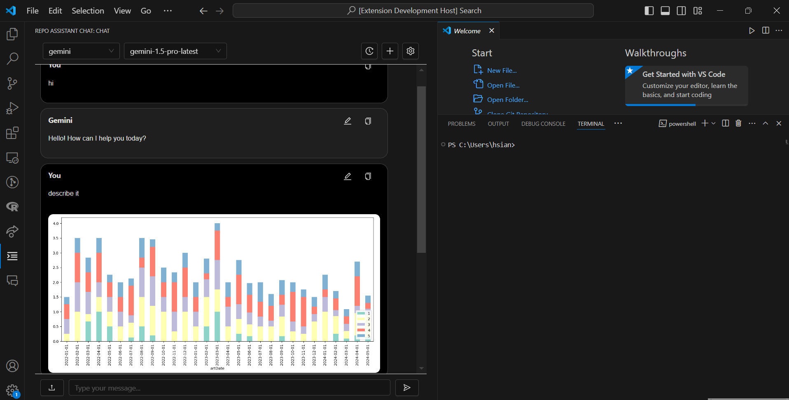
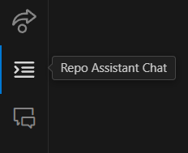
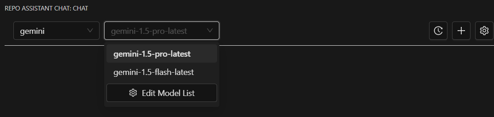
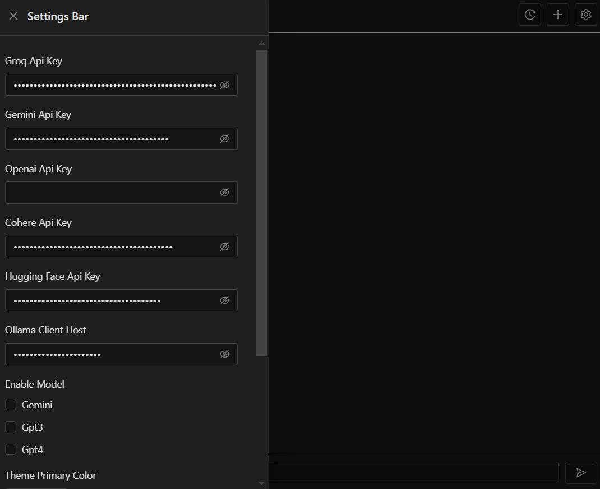

# CodeBRT

CodeBRT is an AI program generation plugin for VSCode. It helps you quickly generate code through AI, thus improving development efficiency.

## Preview



## Installation Instructions

### 1. Download Node.js

Please ensure you have installed Node.js version 20.0 or above. You can download and install it from the [Node.js official website](https://nodejs.org/).

### 2. Clone the Project

Clone this repository to your local machine:

```sh
git clone https://github.com/whats2000/repo-code-assistant.git
```
### 3. Install Dependencies
Enter the project directory and install the necessary dependencies:

```sh
cd repo-code-assistant/VSCodeExtension/repo-code-assistant
npm install
```

### 4. Run in VSCode
Open VSCode, select File > Open Folder, and then choose the repo-code-assistant/VSCodeExtension/repo-code-assistant folder. Then open the Run and Debug panel in VSCode, and click the green Run button to run the extension.

## Usage Instructions

1. Start the extension: In VSCode, click the extension button to open the extension dialog.
   
2. Choose the appropriate language model: Select the authorized or locally deployed model.
   
3. Enter API: Open the setting bar and enter the API.
   


## Features
- **Quick Code Generation**：Generate code snippets through AI, reducing manual coding time.
- **Intelligent Suggestions**：Provide intelligent code suggestions based on the current code context.
- **Multi-language Support**：Support multiple programming languages, including but not limited to JavaScript, Python, Java, etc.
- **Automatic Formatting and Coding Standards**：Automatically format code to maintain consistent coding style and standards.
- **Automatic Project Structure Generation**：Create new program projects and generate directory structures based on user requirements.
- **Composite Model Generation**：Provide an IDE that integrates language model services.
- **Automatic Generation of Comments, Tests, and Functions**：Generate comments, test cases, and functions based on user needs.
- **Integrated AI Responses**：Integrate and score responses from multiple AI models.
- **Image and Voice Features**：Provide TTV & VTT services and Vision analysis functions.
- **Cross-file Program Generation and Tracking**：Automatically complete and track tasks and progress management from generating project structures to writing and integrating code by the agent.
- **Code Generation Result Comparison**：Compare the code before and after AI generation, making it easy for users to evaluate the generated code.

## Contribution Guidelines

<!--We welcome everyone to contribute to this project. Please read [CONTRIBUTING.md](CONTRIBUTING.md) to understand the detailed process and guidelines. 
-->

## Support

If you encounter any issues during use, please submit them on the [Issues](https://github.com/whats2000/repo-code-assistant/issues) page, and we will address them as soon as possible.

## License

<!--This project uses the [MIT License](LICENSE). -->

